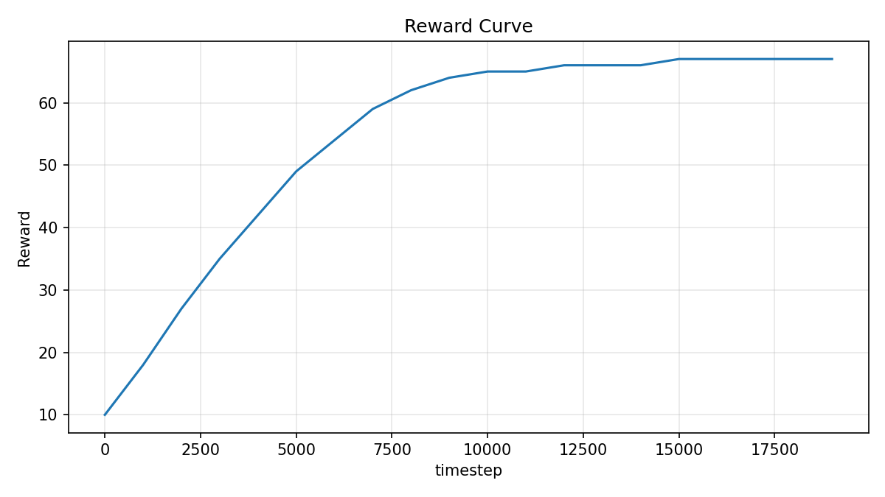
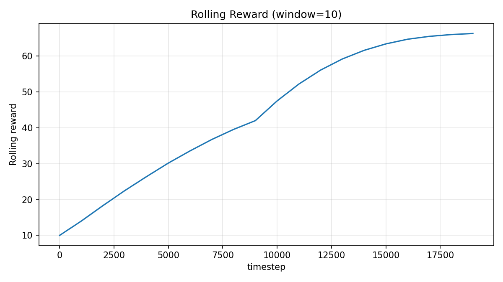
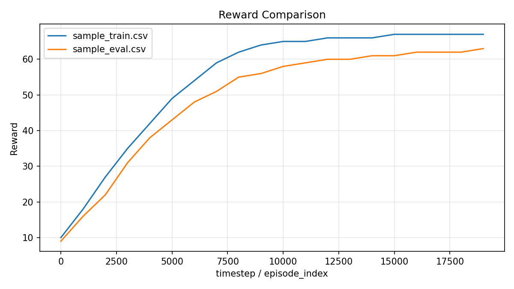

# rl-run-doctor

`rl-run-doctor` is a lightweight command-line tool for diagnosing reinforcement learning training logs. It reads CSV, JSON, JSON Lines / NDJSON, and Stable-Baselines3 `monitor.csv` files, detects common training problems, generates plots, compares runs, and exports Markdown and HTML reports.

## Quick Start

From a fresh checkout:

```bash
python -m pip install -e ".[dev,dashboard]"
python -m pytest
rl-doctor --help
rl-doctor analyze examples/sample_train.csv --output out/analyze
rl-doctor compare examples/sample_train.csv examples/sample_eval.csv --output out/compare
```

After running those commands, open:

```text
out/analyze/report.md
out/analyze/report.html
out/analyze/reward_curve.png
out/analyze/rolling_reward.png
out/compare/report.md
out/compare/report.html
out/compare/compare_reward.png
```

## Screenshots

These screenshots are generated from the included example logs and are checked in so the links do not break.







Regenerate them with:

```bash
rl-doctor analyze examples/sample_train.csv --output docs/screenshots/analyze
rl-doctor compare examples/sample_train.csv examples/sample_eval.csv --output docs/screenshots/compare
```

## Installation

For local development:

```bash
python -m pip install -e ".[dev,dashboard]"
```

For the core CLI without the dashboard dependency:

```bash
python -m pip install -e .
```

The base package does not require Streamlit. Install the dashboard extra only when you want `rl-doctor dashboard`.

## Usage

Analyze one run:

```bash
rl-doctor analyze examples/sample_train.csv --output out/analyze
```

Compare two runs:

```bash
rl-doctor compare examples/sample_train.csv examples/sample_eval.csv --output out/compare
```

Launch the optional dashboard:

```bash
rl-doctor dashboard
```

If Streamlit is not installed, the dashboard command prints:

```text
Streamlit is not installed. Install it with:
pip install "rl-run-doctor[dashboard]"
```

## Supported Logs

- CSV files
- JSON arrays
- Single JSON records
- JSON Lines / NDJSON
- Stable-Baselines3 `monitor.csv`

For SB3 monitor files, metadata lines starting with `#` are skipped and columns are normalized as:

- `r` -> `reward`
- `l` -> `episode_length`
- `t` -> `wall_time`

If no timestep column exists, rl-run-doctor uses the episode index as the plot x-axis.

## Detectors

Detector thresholds are centralized in `DetectorConfig` and are included in every report.

- reward plateau
- reward collapse
- high variance
- low average speed
- high crash rate
- low success rate
- steering oscillation when steering data exists
- train/eval mismatch when both train and eval reward columns exist

Missing optional columns produce warnings and skipped detectors. They do not crash the tool.

## Reports

Each report includes:

- input file path
- detected file format
- normalized columns
- row count
- generated plots
- detector thresholds
- diagnosis summary
- warnings for missing optional columns

## Docker

Build and run:

```bash
docker build -t rl-run-doctor .
docker run --rm -v "$PWD:/work" -w /work rl-run-doctor analyze examples/sample_train.csv --output out/analyze
```

## Upload to GitHub

This project is ready to publish as a GitHub repository. A typical first push is:

```bash
git init
git add .
git commit -m "Initial rl-run-doctor release"
git branch -M main
git remote add origin https://github.com/YOUR_USER/rl-run-doctor.git
git push -u origin main
```

## License

MIT
